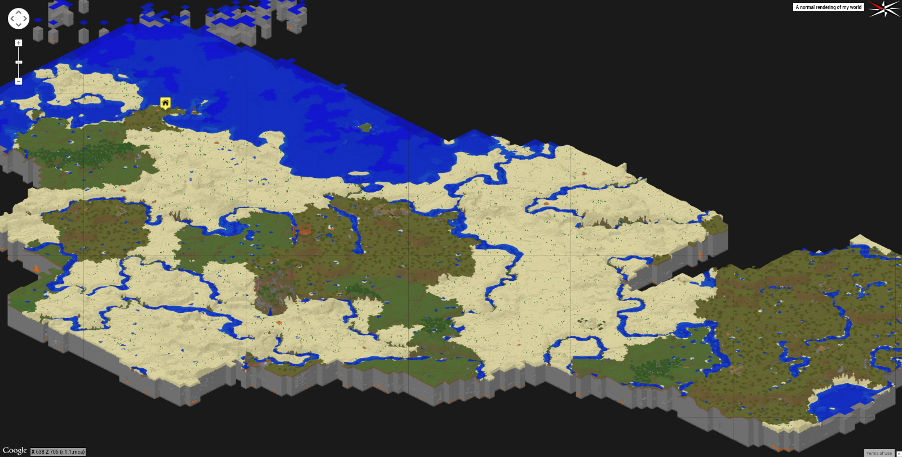

The name stems from me always mistyping Plantae when filling out [my iNaturalist](http://www.inaturalist.org/observations/digitalvapor) observations on the phone.

This is just a periodic rendering of the world on my server that I play with [Star-Bit](https://github.com/Star-Bit) and [Chautauqua](https://github.com/Chautauqua).

Visit [digitalvapor.github.io/kingdomplantar](https://digitalvapor.github.io/kingdomplantar) or [antivapor.net/kingdomplantar](http://antivapor.net/kingdomplantar) to explore it.

Generated with [Minecraft Overviewer](https://github.com/overviewer/Minecraft-Overviewer). The seed was `Professor Layton` and I highly recommend it; so many deep mines, chasms, plenty of villages if that's a thing you care about, ridiculously awesome mountains, and floating islands.

See [world branch](https://github.com/digitalvapor/kingdomplantar/tree/world) for world.

See [overview_config.py](https://gist.github.com/digitalvapor/a8cf4a9bb3bd9c5f2bd4) for my config file. It picks up on some words like 'town', 'tower', etc to change icons.

See [server.properties](https://gist.github.com/digitalvapor/ba1ddffb4b6770558aa8) for our current server properties. Requires `optipng` (`apt-get install optipng`), or comment-out the `optimizeimg` line.

We're using a an [forked irc bot](https://github.com/digitalvapor/minecraft_irc_chat) so you can talk to us at [#kingdomplantar]( https://webchat.freenode.net/?channels=kingdomplantar). Not two-way communication yet.
